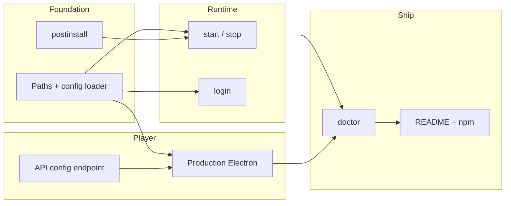

# Reelio — Implementation Plan

Engineering plan for everything required to ship [`PUBLISH.md`](PUBLISH.md). This doc is **how to build it** (tasks, files, order, acceptance criteria). PUBLISH.md stays the **what and why** (product, policy, release gates).

---

## Goal

A fresh machine runs this with no manual dependency steps:

```bash
npm install -g reelio   # postinstall installs Chromium + player deps
reelio hooks install
reelio setup            # writes ~/.reelio/.env only
reelio login
reelio start
# Claude in any project → reels play
reelio doctor           # all checks pass
```

---

## Current state (baseline)

| Area | Status | Notes |
|------|--------|-------|
| Server + API + WebSocket | Done | `index.js`, `server/`, `store/` |
| Reel capture pipeline | Done | Playwright intercept, parser, buffer |
| Global Claude hooks | Done | `lib/claude-hooks.js`, `bin/reelio.js hooks *` |
| Player (dev mode) | Done | Electron + Vite `:5173`, hardcoded API URLs |
| `~/.reelio` player state | Done | `store/playerState.js` |
| Config from `~/.reelio` | **Not done** | Server reads repo-local `.env`, `SESSION_DIR=./session` |
| `postinstall` | **Not done** | No `scripts/postinstall.js` |
| CLI lifecycle commands | **Not done** | `setup`, `login`, `start`, `stop`, `doctor` |
| Production player | **Partial** | `player/dist` exists; Electron still loads Vite dev URL |
| README / LICENSE | **Not done** | |

---

## Work streams

Six parallel tracks. Numbers in **Milestone** sections show build order within a track.



| Stream | Owner focus | Blocks |
|--------|-------------|--------|
| **A — Paths & config** | Centralize `REELIO_HOME`, load `.env` from user dir | login, start, doctor |
| **B — First-install deps** | `postinstall` auto-installs Chromium + player deps | start on fresh machine |
| **C — CLI lifecycle** | `setup`, `login`, `start`, `stop` | doctor, publish |
| **D — Production player** | Electron loads built assets; dynamic API URL | start without Vite |
| **E — Health & ops** | `doctor`, PID/lock files, smoke script | npm publish |
| **F — Docs & release** | README, LICENSE, CHANGELOG, tarball hygiene | `npm publish` |

---

## Milestone 1 — Foundation (paths + postinstall)

**Exit criteria:** `npm install` in a clean clone creates `~/.reelio/` skeleton and installs Playwright Chromium without user action.

### A1 — Config bootstrap module

| | |
|---|---|
| **Create** | `lib/config.js` |
| **Change** | `index.js` — load config before any other module side effects |
| **Change** | `browser/browserManager.js` — default `SESSION_DIR` → `path.join(getReelioHome(), 'session')` |
| **Change** | `.env.example` — document `REELIO_HOME`, note server prefers `~/.reelio/.env` |

**Behavior:**

1. Resolve `REELIO_HOME` (default `~/.reelio`)
2. Load dotenv from `~/.reelio/.env` if present, else fall back to cwd `.env` (dev only)
3. Export `{ reelioHome, port, sessionDir, headless, ... }`

**Acceptance:**

- [ ] Deleting repo `.env` and using only `~/.reelio/.env` still starts server
- [ ] Session persists under `~/.reelio/session/` on global install

### B1 — postinstall script

| | |
|---|---|
| **Create** | `scripts/postinstall.js` |
| **Change** | `package.json` — add `"postinstall": "node scripts/postinstall.js"` |

**Behavior:**

1. `ensureReelioHome()` — create `~/.reelio/`, `~/.reelio/session/` (empty ok)
2. Run `npx playwright install chromium` from package root (skip if `PLAYWRIGHT_SKIP_BROWSER_DOWNLOAD=1` or browser already cached — log skip)
3. Run `npm install --omit=dev` in `player/` **or** verify prebuilt `player/dist` + bundled `player/node_modules/electron` — pick one strategy (see [Decision: player packaging](#decision-player-packaging))
4. Print summary lines; on failure exit 1 with fix hints (network, disk, Node version)

**Acceptance:**

- [ ] Fresh `npm install` on machine without Chromium downloads browser
- [ ] Re-running `npm install` is idempotent (no redundant 200MB downloads)
- [ ] Never prompts for input

### B2 — Install marker (optional but recommended)

| | |
|---|---|
| **Create** | `~/.reelio/install-manifest.json` via postinstall |

Store `{ version, playwrightOk, playerOk, installedAt }` so `reelio doctor` can verify postinstall completed.

---

## Milestone 2 — CLI commands

**Exit criteria:** User never opens two terminals manually; one `reelio start` runs server + player.

### C1 — `reelio setup`

| | |
|---|---|
| **Create** | `lib/setup.js` |
| **Change** | `bin/reelio.js` — add `setup` subcommand |

**Behavior:**

1. Ensure `~/.reelio/` exists
2. Copy `.env.example` → `~/.reelio/.env` if missing (never overwrite)
3. Print next steps: edit `.env`, run `reelio login`, `reelio hooks install`, `reelio start`
4. Optionally offer `--hooks` flag to run `installGlobalHooks()` inline

**Does not:** install Playwright or player deps (postinstall owns that)

**Acceptance:**

- [ ] Second `reelio setup` is safe (no clobber)
- [ ] Works when invoked from any cwd

### C2 — `reelio login`

| | |
|---|---|
| **Create** | `lib/login.js` |
| **Change** | `bin/reelio.js` — add `login` subcommand |
| **Reuse** | `auth/loginHandler.js` |

**Behavior:**

1. Load config from `~/.reelio/.env`
2. Force `HEADLESS=false` for this command only
3. Launch browser → `ensureLoggedIn(page)` → exit 0
4. Session saved to `~/.reelio/session/`

**Acceptance:**

- [ ] Visible browser opens on first login
- [ ] Second run uses saved session (no credential prompt if session valid)
- [ ] 2FA still works via terminal prompt

### C3 — Process launcher (`reelio start` / `reelio stop`)

| | |
|---|---|
| **Create** | `lib/processManager.js` |
| **Create** | `lib/start.js`, `lib/stop.js` |
| **Change** | `bin/reelio.js` |

**`reelio start` behavior:**

1. Check port `3001` free; if not, print PID from lock file or suggest `reelio stop`
2. Spawn server: `node <packageRoot>/index.js` (detached or foreground with `--foreground`)
3. Wait for `GET /api/status` healthy (timeout 60s)
4. Spawn Electron player (production path — see Milestone 3)
5. Write `~/.reelio/reelio.pid` (server PID) and `~/.reelio/player.pid`

**`reelio stop` behavior:**

1. Read PID files; send SIGTERM, then SIGKILL after 5s
2. Call optional cleanup: close Playwright via server shutdown endpoint or kill tree
3. Remove PID files

**Acceptance:**

- [ ] `reelio start` → server responds on `:3001`, player window visible
- [ ] `reelio stop` → no orphan `electron` or `chromium` processes
- [ ] Ctrl+C in foreground mode shuts down both cleanly

---

## Milestone 3 — Production player

**Exit criteria:** Player runs without Vite dev server; API URL configurable.

### Decision: player packaging

Pick **one** for v0.1.0 (document choice in CHANGELOG):

| Option | Pros | Cons |
|--------|------|------|
| **1 — Prebuild in tarball** | Fast install; no player `npm install` in postinstall | Larger npm package; rebuild on player changes |
| **2 — postinstall player npm ci** | Smaller tarball | Slower install; needs network at install time |

**Recommended for v0.1:** Option 1 — add `player/dist/` + ship minimal Electron bootstrap; run `npm run build` in CI before publish.

### D1 — Electron production load path

| | |
|---|---|
| **Change** | `player/electron/main.js` |
| **Change** | `player/package.json` — add `"start:prod": "electron ."` |

**Behavior:**

- If `player/dist/index.html` exists → `loadFile(dist/index.html)`
- Else if `VITE_DEV_SERVER_URL` set → dev URL (contributors only)
- Else → error dialog with "run from reelio start or npm run player"

**Acceptance:**

- [ ] Quit Vite; `reelio start` still shows player UI
- [ ] Built assets load JS/CSS correctly (check Vite `base` if needed)

### D2 — Dynamic API URL

| | |
|---|---|
| **Create** | `GET /api/config` in `server/api.js` |
| **Change** | `player/src/services/reelApi.js` |
| **Change** | `player/src/hooks/usePlayerControl.js` |

**`GET /api/config` response:**

```json
{ "apiBase": "http://localhost:3001", "wsUrl": "ws://localhost:3001/ws" }
```

Player reads config once at bootstrap (env override `VITE_REELIO_API` for dev).

**Acceptance:**

- [ ] Changing `PORT` in `~/.reelio/.env` updates both server and player
- [ ] No hardcoded `localhost:3001` left in player source (except dev fallback)

### D3 — Include player in npm `files`

| | |
|---|---|
| **Change** | `package.json` `files` array — add `player/dist/`, `player/electron/`, `player/package.json` |
| **Change** | `.npmignore` — exclude `player/node_modules`, `player/src` (optional: exclude src if only shipping dist) |

---

## Milestone 4 — Doctor & smoke tests

**Exit criteria:** `reelio doctor` diagnoses a broken install in plain language.

### E1 — `reelio doctor`

| | |
|---|---|
| **Create** | `lib/doctor.js` |
| **Change** | `bin/reelio.js` |

**Checks (each → pass / warn / fail):**

| Check | How |
|-------|-----|
| Node ≥ 18 | `process.version` |
| `~/.reelio/.env` exists | fs |
| Playwright Chromium | `playwright --version` + browser path exists |
| Session logged in | `GET /api/status` if server up, else offline skip |
| Port 3001 | connect or EADDRINUSE explanation |
| Hooks installed | reuse `getHookStatus()` |
| Player dist present | `player/dist/index.html` |
| postinstall manifest | `install-manifest.json` if B2 done |
| Buffer ready | `GET /api/buffer/status` when server running |

Exit code: 0 all pass, 1 any fail, 2 warnings only.

**Acceptance:**

- [ ] Fresh machine before login → doctor lists missing steps in order
- [ ] Healthy running system → all green

### E2 — Smoke test script

| | |
|---|---|
| **Create** | `scripts/smoke-test.sh` |
| **Change** | `package.json` — `"test:smoke": "bash scripts/smoke-test.sh"` |

Automate fresh-machine checklist items 6–8 from PUBLISH.md (curl buffer, optional WS connect).

---

## Milestone 5 — Docs & npm publish

**Exit criteria:** `npm publish` produces an installable tarball; README sufficient without reading this doc.

### F1 — README + legal

| | |
|---|---|
| **Create** | `README.md`, `LICENSE`, `CHANGELOG.md`, `.npmignore` |

README sections: install, hooks, setup/login/start, troubleshooting, disclaimers (from PUBLISH.md legal section).

### F2 — package.json metadata

```json
{
  "version": "0.1.0",
  "repository": "...",
  "homepage": "...",
  "bugs": "...",
  "files": ["bin/", "lib/", "hooks/", "server/", "store/", "browser/", "fetcher/", "parser/", "auth/", "scripts/", "player/dist/", "player/electron/", "player/package.json", "index.js", ".env.example"]
}
```

### F3 — Publish runbook

1. Bump version in `package.json` + `CHANGELOG.md`
2. `cd player && npm run build`
3. `npm pack` — inspect tarball contents (no `.env`, no `session/`)
4. Test pack on clean VM: `npm install -g ./reelio-0.1.0.tgz`
5. `npm publish --access public`
6. Git tag `v0.1.0`

---

## Suggested build order (single developer)

| Step | Task | Est. |
|------|------|------|
| 1 | A1 — `lib/config.js` + wire `index.js` / `browserManager` | 2h |
| 2 | B1 — `scripts/postinstall.js` | 3h |
| 3 | C1 — `reelio setup` | 1h |
| 4 | D1 + D3 — production Electron + tarball layout | 3h |
| 5 | D2 — `/api/config` + player client | 2h |
| 6 | C2 — `reelio login` | 2h |
| 7 | C3 — `reelio start` / `stop` | 4h |
| 8 | E1 — `reelio doctor` | 3h |
| 9 | E2 — smoke script | 2h |
| 10 | F1–F3 — README, legal, publish | 4h |

**Total ~26h** to v0.1.0 publish-ready on macOS.

---

## CI (GitHub Actions)

| Job | Trigger | Steps |
|-----|---------|-------|
| **test** | PR | `npm ci` → unit tests (`reelStore`, `bufferManager`, `claude-hooks`) |
| **build** | PR | `cd player && npm ci && npm run build` |
| **pack-smoke** | main | `npm pack` → install tgz in fresh container → `reelio doctor` (offline checks) |

---

## v0.2 backlog (post-publish)

Not required for v0.1.0; track separately:

- Merge player deps into root `package.json` (single lockfile)
- Auto `reelio hooks install` at end of `reelio setup --hooks`
- Windows/Linux path and process manager audit
- `electron-builder` `.dmg` (Phase 4 in PUBLISH.md)

---

## Definition of done (v0.1.0)

- [ ] All Milestone 1–5 acceptance checkboxes pass on a **clean macOS VM** (Node 18+ only)
- [ ] PUBLISH.md fresh-machine checklist (items 1–11) passes
- [ ] No secrets in npm tarball or git
- [ ] ARCHITECTURE.md updated if CLI or config paths changed

---

## Related docs

- [`PUBLISH.md`](PUBLISH.md) — product definition, policies, release phases, legal
- [`ARCHITECTURE.md`](ARCHITECTURE.md) — runtime architecture
- [`PLAYER_PLAN.md`](PLAYER_PLAN.md) — player + hook behavior
